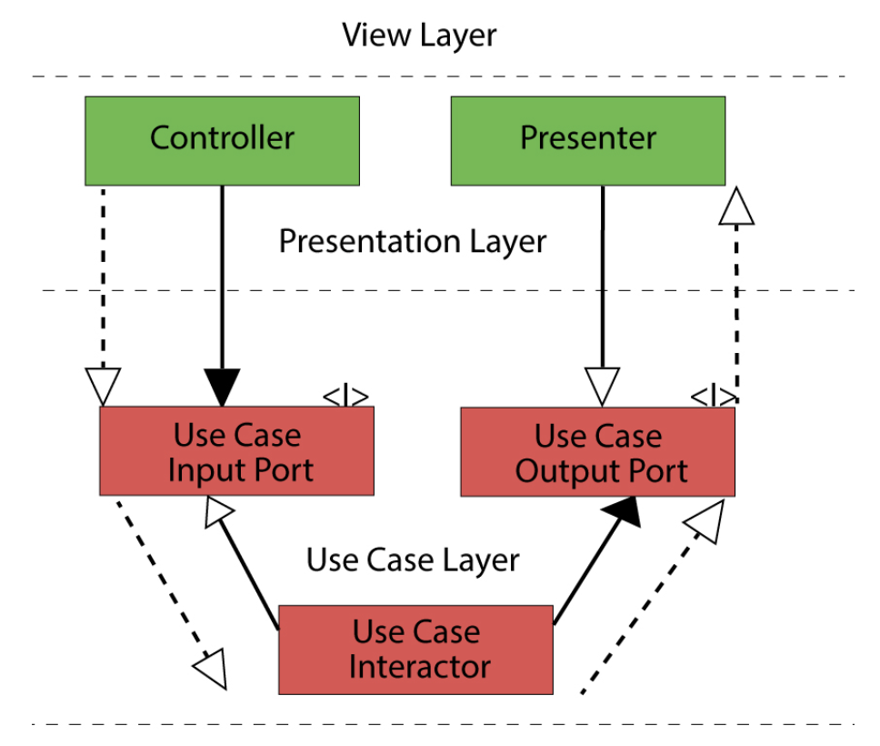
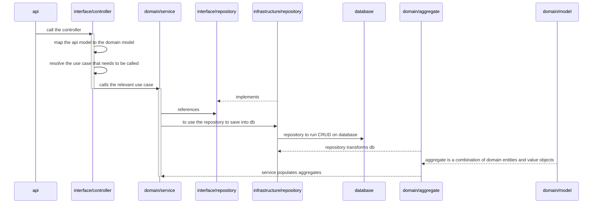

# Application Architecture

The application structure is a loose interpretation of hexagonal architecture and Domain Driver Design (DDD).

Following the [hexagonal architecture](https://blog.cleancoder.com/uncle-bob/2012/08/13/the-clean-architecture.html) it has four layers (plus one):

* (Frameworks & Drivers)
* Infrastructure
* Interface Adapters
* Application Business Rules
* Enterprise Business Rules

The main principle is that code layers should not know about the outer layers and should only communicate with them using inversion of control. Conversly, outer layers can know and depend on the inner layers. In this way, `Entities` should not depend on any other layer while `Controllers` can depend on `Use Cases` and `Entities`.

Interface Adapters and Ports are the boundary between Use Cases layer inwards and Interface layer outwards. Following the inversion of control principles and hexagonal architecture, if a use case layer wants to call a repository in infrastrcture, or a presenter they should define an interface, have outer layers implement that interface, and use that interface as a port to invoke the concrete implementation.

## Information Flow
This is the flow of execution of the application. Dotted lines with a full arrow highlight the flow of execution

