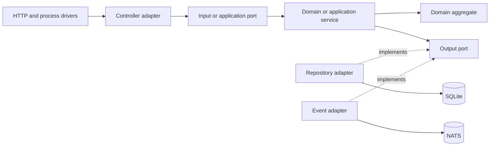

# Application architecture

This project is a modular monolith: it runs as one application, while each domain module owns its model, use cases, ports, and adapters. Module boundaries provide the same dependency discipline that would be required if a module were extracted later, without adding a distributed-system boundary prematurely.

The design combines Clean Architecture, hexagonal architecture, and DDD. These names describe complementary concerns:

- DDD defines the business model, aggregate boundaries, and ubiquitous language.
- Clean Architecture defines the dependency rule: source dependencies point inward.
- Hexagonal architecture expresses external interactions as ports implemented by adapters.

## Dependency rule

Inner layers do not import concrete outer-layer implementations. Outer layers may depend on inner types and contracts.

| Layer | User module examples | Responsibility |
| --- | --- | --- |
| Domain | `internal/user/domain` | Entities, value objects, aggregates, domain events, and domain services |
| Application | `internal/user/application` | Workflow state and services that coordinate domain behavior |
| Ports | `internal/user/ports` | Narrow input, application, repository, and event contracts |
| Adapters | `internal/user/adapters` | HTTP model mapping, controllers, SQLite, and memory implementations |
| Frameworks and drivers | `internal/api`, `internal/infra`, `cmd`, `pkg` | Routing, process startup, databases, messaging, and communication clients |

Ports belong at the inner boundary they protect. An inner service references a port, while a concrete outer adapter implements it. The port may expose domain or application types because those types are farther inward; the inner layer never imports the adapter.

`internal/user/module.go` is the composition root for the user module. It chooses concrete adapters and injects them through port interfaces. Wiring belongs there rather than in domain or application packages.

## Aggregate and repository boundary

`aggregate.User` is the user aggregate root. It owns durable user state and the `VerifyRegistration` state transition. A registration credential is not part of that business state; it is short-lived workflow data owned by the registration application service.

The repository design follows these rules:

- `UserRepository` defines ordinary user aggregate persistence.
- `RegistrationRepository` defines the registration workflow's persistence needs.
- `SQLiteUserRepository` and `MemoryUserRepository` implement both narrow port facets.
- The two interfaces do not imply two independently callable concrete repositories.
- `CompleteRegistration` is the single write path for activating the aggregate, updating its email projection, and consuming the credential.

Keeping one concrete write boundary prevents the aggregate and projection from being updated through competing paths. The SQLite adapter performs the three changes in one transaction; a missing or stale credential rolls the transaction back.

## Domain events

Domain events contain business facts, not transport secrets. `UserRegisteredEvent` identifies the registered user and their status, but never contains a registration token or digest.

The communication listener reacts to the event and asks the registration application service to issue a credential. This keeps secret generation out of the aggregate and prevents secrets from entering the event stream.

## Module communication

Modules communicate through explicit contracts or events. They must not reach into another module's repository or mutate another module's aggregate. Shared infrastructure can live under `pkg` or `internal/infra`, but domain-specific behavior stays with its owning module.

See [Registration verification](./registrationverification.md) for the implemented end-to-end example.
