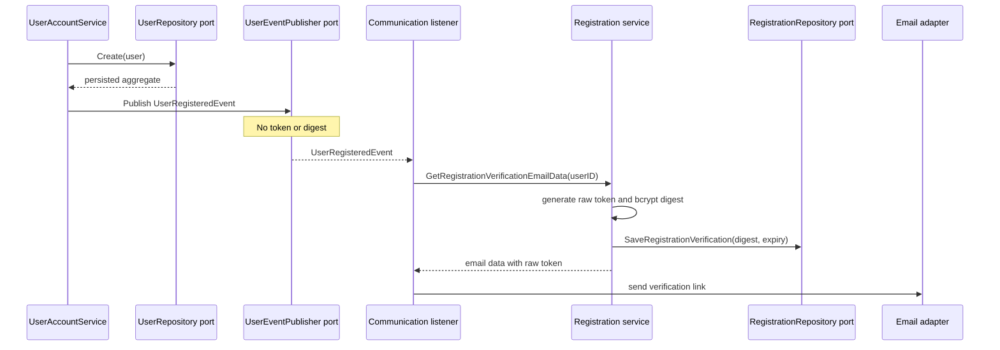

# Registration verification

Registration verification demonstrates how a cross-layer workflow can preserve both Clean Architecture boundaries and an aggregate's transactional consistency.

The user aggregate owns the resulting business state: whether the account is active and its email is verified. The registration application service owns the temporary credential lifecycle. Token generation and hashing therefore do not belong in the aggregate.

## Ownership

| Data or behavior | Owner | Reason |
| --- | --- | --- |
| User activation and verified-email state | `domain/aggregates.User` | Durable business state and invariant |
| Credential digest and expiry | `application/registration.Verification` | Temporary application workflow state |
| Token generation, hashing, and comparison | `application/services.Registration` | Orchestration concern, not domain behavior |
| Persistence contract | `ports/output/repositories.RegistrationRepository` | Inner-layer boundary for storage operations |
| SQLite and memory behavior | `adapters/repositories` | Concrete outer implementations |
| Raw token delivery | `pkg/communication` | External communication concern |

## Issuing a credential



The raw token exists only in application memory and the outgoing verification message. SQLite stores the bcrypt digest with a 24-hour expiry. Issuing another credential for the same user replaces the previous row.

## Completing verification

The client sends:

```http
POST /users/verify-registration?uid=<user-id>&token=<raw-token>
```

The information crosses the layers in this order:

| Step | File | Method | Table and columns |
| --- | --- | --- | --- |
| Validate request | `internal/api/handlers/users_route.go` | `VerifyRegistration` | None |
| Translate application error | `internal/user/adapters/controllers/user_controller.go` | `VerifyUserRegistration` | None |
| Load credential | `internal/user/application/services/registration.go` | `VerifyUserRegistration` | `user_registration_verifications.user_id`, `secret_digest`, `expires_at` |
| Compare secret | `internal/user/application/services/registrationverification.go` | `matchesRegistrationVerification` | No write; bcrypt compares raw token with digest |
| Apply domain transition | `internal/user/domain/aggregates/user.go` | `VerifyRegistration` | In-memory aggregate only |
| Commit atomically | `internal/user/adapters/repositories/registrationverification.go` | `CompleteRegistration` | Update `users_aggregate.value_data`; update `users_email_view.has_verified_email`; delete matching `user_registration_verifications` row |

`CompleteRegistration` deletes the credential using both `user_id` and `secret_digest`. Exactly one row must be consumed. If the credential is missing or has been replaced, the transaction returns `ErrRegistrationVerificationNotFound` and rolls back the aggregate and projection updates.

## Failure behavior

| Condition | Result |
| --- | --- |
| Missing or already consumed credential | Verification fails; user state is unchanged |
| Expired credential | Verification fails; credential remains available for explicit replacement or cleanup |
| Token does not match the digest | Verification fails; credential and user state are unchanged |
| Credential replaced during completion | Atomic completion fails and all writes roll back |
| Valid credential | User activates, email becomes verified, and credential is consumed |

A successfully consumed token is one-time. Replaying it follows the missing-credential path and returns a bad request at the HTTP boundary.

## Repository rule

`UserRepository` and `RegistrationRepository` are narrow contracts for different consumers, but both are implemented by the same concrete user repository adapter. This preserves one aggregate write boundary.

Do not introduce a separately injectable registration-verification repository that can update or consume the credential independently of aggregate completion. Such a path could leave `users_aggregate`, `users_email_view`, and the credential out of sync.

## Security properties

- Raw verification secrets are not persisted in aggregate JSON, projections, credential rows, or domain events.
- Bcrypt digests use a cost of 14, above the project's minimum cost of 12.
- Credentials expire after 24 hours.
- SQL lookups and deletes use parameterized queries.
- HTTP responses expose sanitized errors rather than storage details.
- SQLite and memory adapters enforce equivalent one-time behavior.

The end-to-end regression is in `internal/user/application/services/registrationintegration_test.go`.
